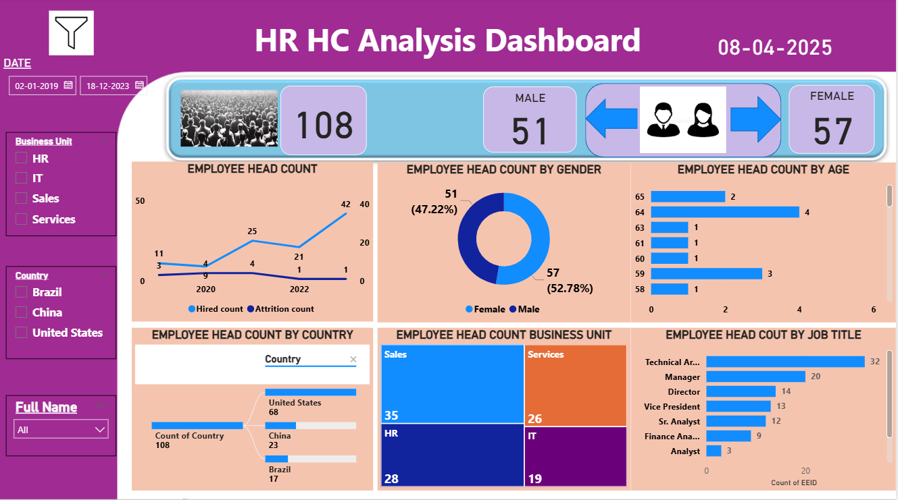

# HR Analytics Dashboard (Power BI)

This project presents an **HR Analytics Dashboard** developed in Power BI.  
It helps analyze workforce data, track employee demographics, and monitor headcount trends for better HR decision-making.  

---

## 📌 Dashboard Pages  

### 1. HR Dashboard Overview (Summary Page)  
- **Frequency:** Data is updated every Friday  
- **Data Source:** Excel  
- **Overview:** Interactive dashboards leveraging HR analytics for direct data exploration  
- **Refresh Date:** 08-04-2025  
- **Contact:** pradhap.mohan45@gmail.com  

**Screenshot:** 

 

---

### 2. HR HC Analysis Dashboard (Analysis Page)  
- **Employee Headcount:** Total 108 employees  
- **Gender Distribution:** Male (51) vs Female (57)  
- **Headcount Trends:** Hired vs Attrition counts over time  
- **Headcount by Country:** USA, China, Brazil  
- **Business Unit Distribution:** Sales, Services, HR, IT  
- **Job Title Breakdown:** Technical Architect, Manager, Director, VP, Sr. Analyst, Finance Analyst, Analyst  
- **Filters Available:** Date range, Business Unit, Country, Full Name  

**Screenshot:**  
  

---

## 🛠 Tools & Technologies  
- **Power BI Desktop** – Dashboard creation  
- **Excel** – Data source  
- **Power Query** – Data cleaning & transformation  

---

## 🚀 Key Insights  
- Provides clear visibility into headcount distribution and workforce structure  
- Highlights attrition and hiring trends over time  
- Identifies workforce patterns by country, business unit, and job role  
- Helps HR teams design retention and hiring strategies  

---

## ▶️ How to Use  
1. Clone or download this repository  
2. Open the `.pbix` file in **Power BI Desktop**  
3. Explore dashboards using available slicers and filters  
4. Replace the sample dataset with your own HR data (optional)  

---

## 📬 Contact  
For queries or collaboration, feel free to connect:  
**Email:** pradhap.mohan45@gmail.com  
